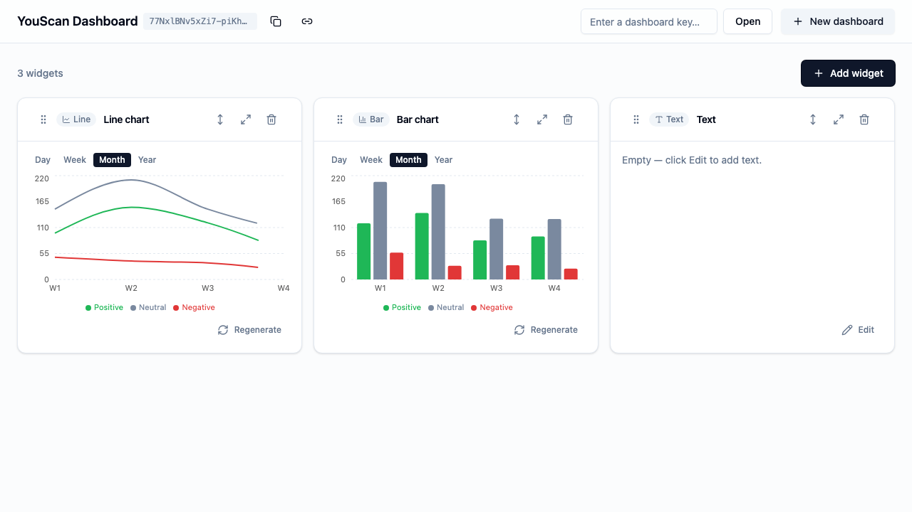

# YouScan Widget Dashboard

**Live demo:** [dash.youscan.sashklym.cc](https://dash.youscan.sashklym.cc) · **API + Swagger:** [api.youscan.sashklym.cc/docs](https://api.youscan.sashklym.cc/docs)

A small but production-shaped full-stack app: a dashboard of **line-chart**, **bar-chart**, and **text** widgets in a responsive grid. Charts can be viewed by **day, week, month, or year**. Widgets are added, deleted, and reordered — by drag-and-drop, or by per-widget **move actions** (start / up / down / end) — and their positions, chart data, and text edits all persist and restore across reloads. Big dashboards stay fast: past ~60 widgets the grid **virtualizes**, rendering (and fetching data for) only the widgets on screen.

There are no logins. Each dashboard is an **anonymous, shareable key** — the app lives at `/d/:key`, remembers your key locally, and lets you re-open it on any device.



## Architecture — a single source-of-truth contract

The backend owns the API contract; the frontend generates its client from it. No HTTP is ever hand-written.

```
be/ (Fastify + TypeBox route schemas)
  └─ npm run openapi:export ─▶ openapi.json ─┐
                                             ├▶ fe/ orval → typed client + React Query hooks
fe/ ── npm run api:generate ─────────────────┘        (src/lib/api/generated/, committed)
```

Both `openapi.json` and the generated client are committed, and CI fails if either drifts from the source — so the frontend and backend can never silently disagree.

## Stack

| | |
|---|---|
| **Backend** (`be/`) | Node 22 · Fastify · Inversify (DI) · TypeORM · SQLite · TypeBox · pino |
| **Frontend** (`fe/`) | React 18 · Vite · TypeScript · Tailwind · shadcn/ui · Recharts · React Query |
| **Contract** | `@fastify/swagger` (OpenAPI 3.1) → **orval** client generation |
| **Tests** | Vitest (BE unit + integration, FE unit) · Playwright (whole-service e2e) |
| **CI** | GitHub Actions — lint · typecheck · test · OpenAPI-drift on every push/PR |
| **Deploy** | Coolify (Docker), local-triggered — see below |

## Layout

```
be/     Fastify backend — owns the OpenAPI contract, SQLite persistence
fe/     React frontend — consumes the generated client
e2e/    Playwright whole-service tests + screenshots
docs/   Bounded-context documentation + ROADMAP
```

## Quickstart

```bash
# Backend  → http://localhost:3000  (Swagger UI at /docs)
cd be && cp .env.sample .env && npm install && npm run dev

# Frontend → http://localhost:5173
cd fe && cp .env.sample .env && npm install && npm run dev
```

Open http://localhost:5173 — it creates a dashboard and redirects to `/d/:key`. Add widgets, edit the text widget, reload, and everything is restored. Copy the key (top bar) and open it in another browser to see the same dashboard.

## Tests

```bash
cd be && npm run test:unit && npm run test:integration   # 15 + 19 tests
cd fe && npm run test:unit                                # 22 tests
cd e2e && npm install && npx playwright install chromium && npx playwright test
```

The e2e run writes step-by-step screenshots to [`e2e/screenshots/`](e2e/screenshots/).

## Load testing

Bulk-create widgets against any environment to see how the grid (and API) hold up at scale:

```bash
BASE_URL=https://api.youscan.sashklym.cc COUNT=1000 CONCURRENCY=50 npm run load:widgets
```

Spins up a fresh dashboard (or pass `KEY=` to target an existing one) and prints a `/d/:key` link to open. See [`scripts/load-widgets.mjs`](scripts/load-widgets.mjs) for all options.

## Deployment

Two Coolify apps built from Dockerfiles (`be/Dockerfile` → Node, `fe/Dockerfile` → nginx), served at `api.` / `dash.youscan.sashklym.cc`. Coolify runs on a private network and pulls the public repo, so deploys are triggered from a local machine (`npm run deploy`, see `scripts/deploy.sh`) rather than public CI. Full setup in [`docs/ops/deployment.md`](docs/ops/deployment.md).

## Docs

- [`docs/README.md`](docs/README.md) — documentation by bounded context
- [`docs/ROADMAP.md`](docs/ROADMAP.md) — what's shipped and what's next
- [`CLAUDE.md`](CLAUDE.md) — guide for AI agents working in this repo
