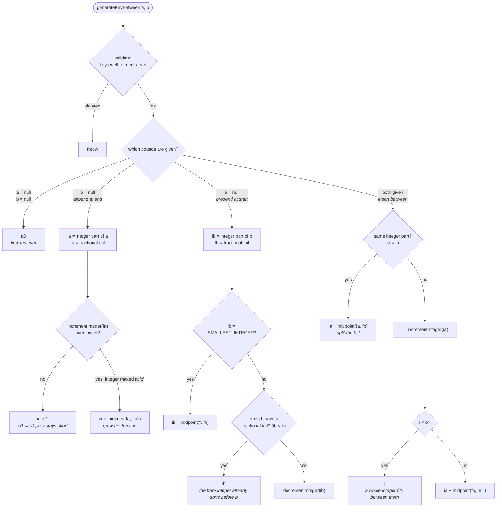
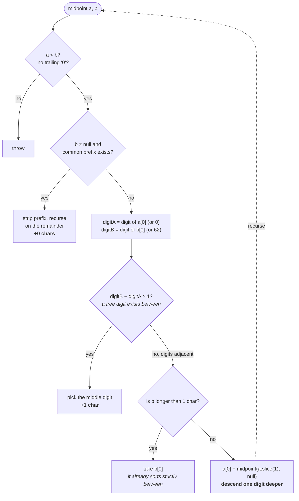
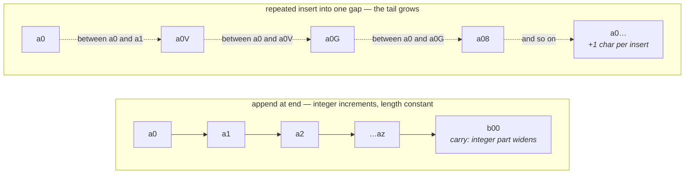

# Fractional widget ranking

Order widgets by a fractional string `rank` instead of a contiguous integer
`position`, so moving a widget is a single-row write regardless of dashboard size.

> **Retired by [row-based-widget-layout](row-based-widget-layout.md).** Widgets now
> store an explicit `(row_index, col_index)` slot on a 3-column grid, which is already
> a total order — so `rank` became a redundant second source of truth and was dropped
> by the `AddWidgetRowLayout` migration. The reasoning below is kept because it still
> explains `core/fractional-index.ts`, which survives: the migration's `down` path uses
> `generateNKeysBetween` to rebuild `rank` from the slot order.

## Why

With integer positions, moving a widget from the end to the front renumbers every
row in between — O(n) writes per move, and it forces the list API to renumber
trailing rows too. Fractional indexing assigns each widget a string key that sorts
lexicographically, with room to always mint a new key *between* any two neighbors.
A move computes one key and saves one row; the rest are untouched.

## How it works

A rank is a base-62 string over the digits `0-9A-Za-z`, ordered so that comparing
two keys lexicographically is the same as comparing the fractions they denote —
which is why SQL can sort them with a plain `ORDER BY rank ASC` and no custom
collation. Conceptually `a0V` sits between `a0` and `a1` the way `0.5` sits
between `0` and `1`.

The first character encodes the length of the key's *integer part*. That is the
whole trick: appending at the end (the common create path) increments an integer
instead of growing a fractional tail, so keys stay short.

### `generateKeyBetween(a, b)`

Every cheap path ends in an integer increment. The algorithm only descends into
the fractional part when there is no whole integer left between the neighbors.

### `midpoint(a, b)` — where keys actually grow

### The two regimes, side by side

Normal use pays nothing; the pathological case — inserting into the same gap over
and over — pays a linear string growth, which a periodic re-spread
(`generateNKeysBetween`) resets.

Two invariants hold this together. A key never ends in `0` (`validateOrderKey`),
otherwise `a0` and `a00` would denote the same fraction and the order would be
ambiguous. And two clients inserting into the same gap concurrently mint the
*identical* key, so the list order is `rank ASC, created_at ASC` — the timestamp
is the tie-break, not decoration.

## Phases

- [x] `core/fractional-index.ts` — `generateKeyBetween(a, b)` + `generateNKeysBetween` (base-62, integer-header scheme so appends stay short), with unit + fuzz tests
- [x] `Widget.rank: string` replaces `position`; index `(dashboard_id, rank)`
- [x] Migration `AddWidgetRank` — backfill ranks per dashboard from existing position order, then drop `position` (down reverses)
- [x] Service: `create` appends after the last rank; `moveToPosition` rewrites one rank between neighbors; `reorder` re-spreads fresh ranks (small grid)
- [x] Contract: `Widget.rank` in the OpenAPI schema; regenerate the fe client

## Design decisions

- **String keys, not floats.** A float midpoint (`(a+b)/2`) hits double-precision
  limits after ~50 same-gap inserts and needs a rebalance path early. Base-62
  strings sort in SQL directly and have no practical precision ceiling.
- **Integer-header scheme (rocicorp `fractional-indexing`).** The first character
  encodes the integer-part length, so append-at-end (the common create path)
  increments an integer and stays short — 1000 sequential appends keep keys ≤ 5
  chars, versus ~200 for a naive midpoint-to-end.
- **Rebalance is deferred, not needed at this scale.** Pathological repeated
  insertion into one gap grows keys slowly; a periodic re-spread (as `reorder`
  already does) is the escape hatch if it ever matters.

## Acceptance

Widgets sort by `rank ASC`. Creating appends after the last widget. Moving one
widget writes exactly one row and lands it strictly between its new neighbors.
The migration backfills existing dashboards without reshuffling their order.
