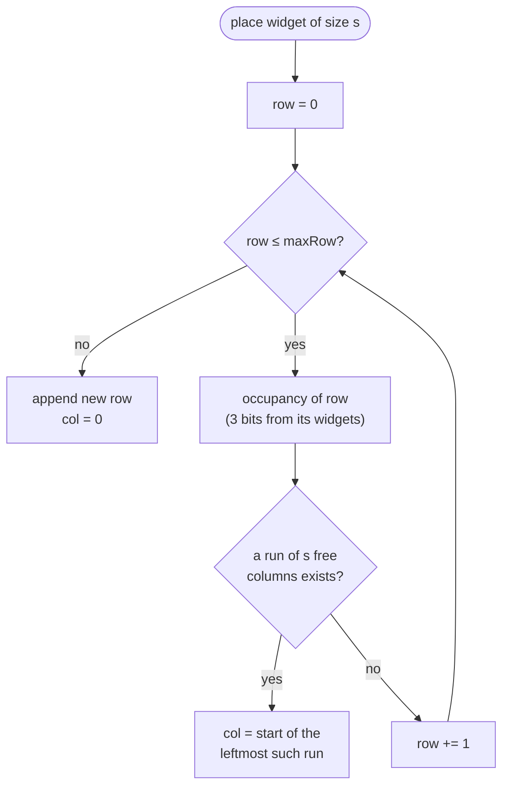

# Row-based widget layout

Give each widget a `size` of 1, 2, or 3 columns and place it in an explicit
`(row, col)` slot. A size-3 widget fills its row. A new widget lands in the first
row from the top with enough free columns. Ordering stops being a flat list.

> **Supersedes [fractional-widget-ranking](fractional-widget-ranking.md).**
> `(row, col)` is already a total order, so `rank` becomes a redundant second
> source of truth for the same thing and is dropped. That is the largest single
> consequence of this feature — see *Retiring rank* below before starting.

## Why

Every widget is one column wide, so a line chart with twelve monthly buckets gets
the same slice of viewport as a two-line text note. Widening a widget is the
obvious fix, but a width alone doesn't say *where* the widget goes once widths
differ — and that question is what turns a small feature into a structural one.

Today the answer is implicit: widgets are a flat list ordered by `rank`, and CSS
grid auto-placement decides rows at render time. Rows aren't a thing that exists;
they're a thing the browser computes and forgets. Once widgets have different
widths, three behaviours we want cannot be expressed that way:

- **A hole is meaningful.** Delete the size-1 widget beside a size-2 one and the
  gap should stay open for the next widget, not suck the rest of the board up a
  row.
- **"Nearest row with free columns" needs rows to exist.** First-fit placement is
  a statement about a structure, and the structure has to be stored to be scanned.
- **The virtualizer needs to count rows without reading widgets.** `MAX(row) + 1`
  is a scalar. Deriving the row count from a flat list means knowing every
  widget's size, i.e. reading the whole dashboard.

So rows become real: a widget stores the row it's in and the column it starts at.

## How it works

### The canonical grid is 3 columns

`size` is a column span in a 3-column grid, and `col + size ≤ 3` always. Size 3
means the widget owns its row — literally, not approximately. The current
`2xl:grid-cols-4` breakpoint is removed; a 4th column would make "size 3 fills the
row" false on wide screens and would mean the server's placement decisions no
longer match what a wide-screen user sees. Wide viewports get a `max-w-*`
container instead.

Card height stays fixed (`h-[360px]`), so a row is exactly one card tall and the
virtualizer still needs no dynamic measurement. There is no `row-span`.

### Placement — first fit from the top

A row's occupancy is three bits. On create, scan rows from 0 for the first run of
`size` contiguous free columns; if no row has one, open a new row at the bottom.



Contiguity is the part that's easy to get wrong. A row holding a size-1 widget at
`col 0` and another at `col 2` has one free column, but it is not a *run* of two —
a size-2 widget must skip that row even though `3 - 2 = 1` column is "free".

```
row 0:  [ w0 ][ ░░ ][ w1 ]     free = 1, runs = {col 1: 1}
        size-1 → fits at col 1
        size-2 → does not fit; keep scanning
```

### Holes persist; empty rows collapse

Deleting a widget frees its columns and leaves the row in place, hole and all —
that hole is what the next `create` fills. But a row whose *last* widget is
deleted has nothing left to hold open, so it collapses and the rows beneath shift
up. That shift is one statement, not N writes:

```sql
UPDATE widgets SET row_index = row_index - 1
 WHERE dashboard_id = ? AND row_index > ?
```

Resizing follows the same rule: if the new size doesn't fit in the widget's
current row, the widget is re-placed by first-fit, and its old row collapses if it
emptied.

### Retiring rank

`ORDER BY row_index ASC, col_index ASC` is a total order over a dashboard's
widgets. Keeping `rank` alongside it would mean two orderings that can disagree,
and every write would have to maintain both. So `rank` goes.

This gives back the O(1)-write property that
[fractional-widget-ranking](fractional-widget-ranking.md) bought — but it costs
less than it looks, because the operations that shift rows are all single bulk
`UPDATE`s over an indexed range, not N round-trips:

| Operation | Rows touched | Writes |
|---|---|---|
| create (fits an existing hole) | 1 | 1 insert |
| create (opens a new row) | 1 | 1 insert |
| delete (row survives) | 1 | 1 delete |
| delete (row emptied) | all below | 1 delete + 1 bulk `UPDATE` |
| resize within the row | 1 | 1 |
| resize forcing a re-place | ≤ 2 rows + below | 1 + 1 bulk `UPDATE` |
| reorder (full list) | all | 1 bulk save — unchanged from today |

What genuinely does get worse is **create**: first-fit from the top is an O(n)
read of `(row_index, col_index, size)` for the dashboard. At the scale the
virtualizer was built for (10k widgets) that's an index-only scan of a three-int
projection on every add. Acceptable now; the escape hatch, if it ever isn't, is a
per-dashboard row-occupancy summary table.

### Ordering, and why paging changes

The list endpoint pages by `offset`/`limit` **in widgets**
([paginated-widget-list-api](paginated-widget-list-api.md)), and `VirtualWidgetGrid`
converts a visible row range into an item range by multiplying by the column count.
With variable spans that multiplication is meaningless — row 40 is not item 120.

Paging moves to row ranges, which is what the virtualizer actually asks for:

```
GET /api/dashboards/:key/widgets?fromRow=0&toRow=12
  → { items, totalRows, total, fromRow, toRow }
```

`totalRows` (a `MAX(row_index) + 1` scalar) sizes the scrollbar without reading a
single widget. Mounted rows map directly onto a fetch range. `total` stays for the
"N widgets" header.

The move endpoint changes shape for the same reason. `PUT …/widgets/:id/position`
takes a flat index, and a flat index no longer identifies a slot:

```
PUT /api/dashboards/:key/widgets/:id/place   { row, col }
```

Drag-and-drop drops onto a slot. The move menu's start / up / down / end resolve
to the neighbouring slot in reading order and call the same endpoint. If the drop
doesn't fit, the target row re-packs and the overflow pushes down.
`PUT …/widgets/reorder` keeps its `orderedIds` body and becomes the **compact**
operation: re-place every widget by first-fit in the given order, squeezing out
every hole.

### Narrow viewports: let CSS do it

Stored `(row, col)` is canonical **at 3 columns**. Below `lg` a 3-wide row cannot
fit, so the stored columns have to give way.

The trick is that the virtualizer's unit is the *server's row*, not a visual row.
Each row renders as its own CSS grid holding its one-to-three widgets. At `lg` the
`lg:col-start-*` classes pin each widget to its stored column — which is what keeps a
hole a hole, since an item whose explicit start column sits behind the auto-placement
cursor moves to the next line. Below `lg` those classes simply don't apply, the row
packs itself greedily, and it grows taller. The virtualizer measures rather than
assumes (`measureElement`), so nothing has to compute a visual row count at all.

That deletes a whole endpoint from the design. An earlier draft had the client
re-pack narrow viewports itself, which needed every widget's span up front via a
`GET …/widgets/layout → { sizes: number[] }`. Virtualizing over server rows means the
client never needs a global view of the board, so `/layout` was never built.

| viewport | columns | how the row renders |
|---|---|---|
| base | 1 | row's widgets stack; row measures 1–3 cards tall |
| `md` | 2 | greedy 2-column wrap inside the row |
| `lg`+ | 3 | stored `col_index` via `lg:col-start-*`; exactly one card tall |

## Phases

### Data + migration

- [x] `Widget.size` (1–3), `Widget.row_index`, `Widget.col_index` — column names
      avoid the SQLite keyword `ROW`; the public DTO exposes them as `size`,
      `row`, `col`
- [x] `CHECK (col_index + size <= 3)`; index `(dashboard_id, row_index, col_index)`
      replaces `(dashboard_id, rank)`. Non-overlap within a row is a service
      invariant — SQL can't express "size-2 at col 0 collides with size-1 at col 1"
- [x] Migration `AddWidgetRowLayout` (`1710000004000`), mirroring `AddWidgetRank`'s
      backfill-then-drop shape:
      **up** — add `size` (default 1), `row_index`, `col_index`; per dashboard, read
      `ORDER BY rank ASC, created_at ASC` and assign `row_index = ⌊i / 3⌋`,
      `col_index = i % 3` (every existing widget is size 1, so the current 3-column
      reading order is preserved exactly and no board visibly reshuffles); create the
      new index; drop `IDX_widgets_dashboard_rank`; `DROP COLUMN rank`
      **down** — re-add `rank`, backfill with `generateNKeysBetween` per dashboard
      over `ORDER BY row_index, col_index, created_at`, restore the old index, drop
      the three columns
- [x] Migration test: ranks `a0…a4` land at `(0,0) (0,1) (0,2) (1,0) (1,1)`; `up`
      then `down` round-trips; the backfill is scoped per dashboard

### Backend

- [x] `core/place-widget.ts` — `firstFit`, `firstFitInRow`, `fitsAt`, `buildMasks`,
      `compact`; a row's occupancy is a 3-bit mask, so "is there a run of N here?" is
      a mask test. All pure, all unit-tested
- [x] Service: `create` first-fits from the top; `update` grows in place or re-places
      on `size` change; `delete` leaves the hole and collapses an emptied row;
      `place(key, id, row, col)`; `reorder` becomes compact-by-greedy-fill
- [x] `list(key, { fromRow, toRow })` ordered by `(row_index, col_index)`, plus a
      `totalRows` scalar
- [x] Contract: `size`/`row`/`col` on `WidgetSchema`; `size` optional on
      `CreateWidgetBody` and `UpdateWidgetBody`; `ListWidgetsQuery` → `fromRow`/`toRow`;
      `WidgetPage` gains `totalRows`; new `PlaceWidgetBody`; retire `MoveWidgetBody`
- [x] Regenerate `openapi.json` + the orval client; commit both
- [x] ~~`layout(key)` → sizes in reading order~~ — not needed; see *Narrow viewports*

### Frontend

- [x] `useWidgetChunk` / `useWidgetRowWindow` replace the offset/limit page hooks;
      both invalidated by every widget mutation, and by a resize (which can move the
      widget and collapse a row)
- [x] `lib/widget-slot.ts` — `slotClass()` static class map (Tailwind cannot see
      interpolated class names) and `moveTargetSlot()` for the move menu
- [x] `SortableWidgetGrid`: render stored slots via `col-span` / `col-start`;
      drag-drop still calls `reorder`, which compacts
- [x] `VirtualWidgetGrid`: `count = totalRows`; virtualize the *server's* rows and
      fetch the chunks overlapping the window; the `index → (row, col)` arithmetic is
      gone entirely
- [x] `WidgetSizeMenu` — 1 / 2 / 3 in the card header beside `WidgetMoveMenu`
- [x] Remove `2xl:grid-cols-4` from the grid, and delete `useColumnCount` (nothing
      needs the column count any more)
- [x] `VIRTUALIZE_ROW_THRESHOLD` counts rows, not widgets

### Tests + docs

- [x] `place-widget.spec.ts` (contiguity, holes, clamping, compaction), rewritten
      service + integration specs, `widget-slot.test.ts`, `widget-layout.spec.ts`
- [x] Rewrite the `scrolls a newly added widget into view` e2e test and add the
      scroll-*up* case that first fit introduces
- [x] Banner on [fractional-widget-ranking](fractional-widget-ranking.md) marking
      `rank` retired, and update the positioning sections of both `architecture.md`
- [ ] Fold the row-range paging change into
      [windowed-widget-fetching](../dashboard-ui/windowed-widget-fetching.md), which
      is still a draft and currently specifies item-offset windows

## Design decisions

- **Stored `(row, col)`, not derived rows.** Derived rows reproduce first-fit
  placement exactly — inserting into `[2,2]`'s hole yields sizes `[2,1,2]`, which
  greedy-packs back to the intended layout — so placement alone doesn't justify the
  column. What does is everything around it: holes that survive a delete, a row
  count the virtualizer can read as a scalar, and paging by row range. Derived rows
  would need the whole size array on every load and would reflow the board on every
  delete.
- **Drop `rank` rather than keep both.** Two total orders over the same rows drift.
  The write-cost regression is confined to row shifts, which are one indexed bulk
  `UPDATE`; the read-cost regression is first-fit's O(n) scan on create. Both are
  bounded and measurable, and neither reintroduces the N-round-trip renumbering
  that `rank` was introduced to kill.
- **Virtualize the server's rows, not visual rows.** This fell out during
  implementation and deleted a planned endpoint. If the virtualizer's unit is a
  stored row, it needs `totalRows` (a scalar) plus the rows in its window — never a
  global view of the board. Each row is its own CSS grid, so narrow viewports are
  CSS's problem rather than the client's, and `measureElement` absorbs the extra
  height. Re-packing visual rows on the client, the alternative, needs every widget's
  span up front — which is exactly what the discarded `GET …/widgets/layout` served.
- **Rejected: assume size 1 for unloaded widgets.** It makes the row count wrong, so
  the scrollbar is wrong, and every page that arrives re-packs the rows above the
  viewport and yanks the scroll position.
- **Pin the grid to 3 columns.** With a 4th column at `2xl`, "size 3 fills the row"
  is false exactly on the screens where wide widgets matter most, and the server's
  stored `col` no longer describes what a wide-screen user sees.
- **First fit from the top, not from the end.** Chosen deliberately: a new widget
  reuses the earliest gap, so a board that has been edited for a while stays dense.
  The cost is that on a long dashboard the new widget can land far above the fold, so
  `scrollToId` now scrolls *up* — and the old "scrolls a newly added widget into view"
  e2e test, which asserted append-at-the-end, was rewritten rather than extended.
- **Contiguity, not free-column counting.** A row holding size-1 widgets at columns 0
  and 2 has a free column but no *run* of two. `firstFitInRow` tests a shifted 3-bit
  mask, so this is structural rather than a special case — and it has its own test at
  every level, because a naive `free >= size` check passes the obvious hole-filling
  case and silently fails this one.
- **Holes are honest.** `[2,2]` at 3 columns leaves one empty column. Compacting it
  automatically means reordering someone's board behind their back; `reorder` exists
  for when they ask for it.
- **No `grid-auto-flow: dense`.** Backfilling holes reorders widgets visually, so
  reading order would stop matching `(row, col)` — and the move menu's "up"/"down"
  would start lying.

## Test plan

### Run the existing suites

```bash
cd be && npm test          # unit + integration
cd fe && npm test          # vitest + RTL
cd e2e && npm test         # playwright
cd be && npm run openapi:export && cd ../fe && npm run api:generate   # no drift
```

These did **not** pass untouched, and that was expected rather than incidental — the
contract change is breaking. `WidgetGrid.test.tsx`, `WidgetCard.test.tsx` and the
widget integration tests asserted on `rank` and on offset/limit paging; the e2e
`scrolls a newly added widget into view` test asserted append-at-the-end placement,
which first fit deliberately changes. Each was rewritten as a behaviour change, not
patched as a fixture.

### Unit — placement and packing

`firstFit(occupancy, size)` at 3 columns:

| row occupancy | size 1 | size 2 | size 3 |
|---|---|---|---|
| `[ ][ ][ ]` | col 0 | col 0 | col 0 |
| `[w][ ][ ]` | col 1 | col 1 | — |
| `[w][ ][w]` | col 1 | — *(no run of 2)* | — |
| `[ ][ ][w]` | col 0 | col 0 | — |
| `[w][w][w]` | — | — | — |

Plus, over a whole board: a size-2 widget skips a row with two non-adjacent free
columns and takes the next row that has a real run; when no row fits, a new row is
appended; deleting a row's last widget collapses it and shifts the rows below;
deleting one of two widgets leaves the hole open and the next create fills it.

`compact(sizes, startRow)` — the greedy fill behind `reorder` and behind a move onto
an occupied slot: `[1,1,1]`, `[2,1]`, `[1,2]`, `[2,2]` (hole at the end of row 0),
`[3]`, `[1,3]`, `[3,1,1,1]`, `[2,1,1,2]`; `[]` → no rows; `[2,2,1]` proves the tail
of a row is left empty rather than backfilled; an oversized span clamps to 3.

### Integration — the API

Row-range paging returns exactly the widgets in `[fromRow, toRow]` with an accurate
`totalRows`; an out-of-range range is empty rather than an error. `/place` rejects a
slot that doesn't fit and is rejected for a key that doesn't own the widget.
`reorder` compacts every hole. `create` on a full board opens a new row. The `CHECK`
constraint rejects `col + size > 3`.

### E2E — `e2e/tests/widget-layout.spec.ts`

Pinned to 1280×900 so the grid is 3 columns.

- **Resize an existing widget.** Add a line chart, set it to 2 columns, reload —
  still 2. This is the headline requirement: it works on widgets that existed
  before the migration.
- **Complex rows.** Build each combination — `[1,1,1]`, `[2,1]`, `[1,2]`, `[2,2]`,
  `[3]`, `[1,3]`, `[3,1,1,1]`, `[2,1,1,2]` — and assert the packing by geometry
  rather than by class name: group cards by bounding-box `y` (same `y` = same row),
  then compare relative widths. `[2,2]` and `[1,3]` are the ones that only pass if
  wrapping leaves the hole.
- **First fit fills the nearest hole.** Lay out `[2, 2]` (row 0 has a 1-column hole),
  add a size-1 widget, assert it lands on **row 0**, not at the bottom. Then lay out
  `[1, ░, 1]` and add a size-2 widget: it must skip that row — the contiguity case,
  and the one a naive `free >= size` implementation passes the previous test but
  fails here.
- **Deleting leaves the hole.** Delete the size-1 widget beside a size-2 one; the
  rows below do not move. Add a size-1 widget; it fills the gap.
- **A size-3 widget owns its row.** Its width equals the grid's, and nothing shares
  its `y`.
- **Clamping.** With a size-3 widget, resize to 768 (2 columns) and 375 (1 column):
  the card tracks the grid and the page never scrolls horizontally
  (`scrollWidth <= clientWidth`).
- **Virtualized board.** Seed enough mixed-size widgets to cross the row threshold
  through the API request context (as `scripts/load-widgets.mjs` does). The first
  rows match the stored layout, the scrollbar is sized from `totalRows`, and after
  scrolling to the bottom the last widget is on the row the server placed it on —
  i.e. no `total / cols` arithmetic survives.
- **Scroll up to a new widget.** In `dashboard.spec.ts`: punch a hole in row 0 with a
  delete, scroll to the bottom, add a widget. First fit puts it in that hole, above
  the fold, and the grid must scroll back up to it.

## Acceptance

A widget can be set to 1, 2, or 3 columns from its card, including widgets created
before this change, and the choice survives a reload. A size-3 widget fills its row
at every breakpoint ≥ `lg`, and no widget overflows the grid at any breakpoint. A
new widget lands in the first row from the top with a contiguous run of free columns,
and opens a new row only when none has one. Deleting a widget leaves its columns
free for the next one; emptying a row collapses it. The virtualized grid sizes its
scrollbar from `totalRows` and fetches by row range. The migration maps every existing
widget to the slot its `rank` already implied, and `down` restores `rank` exactly.
`openapi.json` and the generated client are regenerated and committed.
